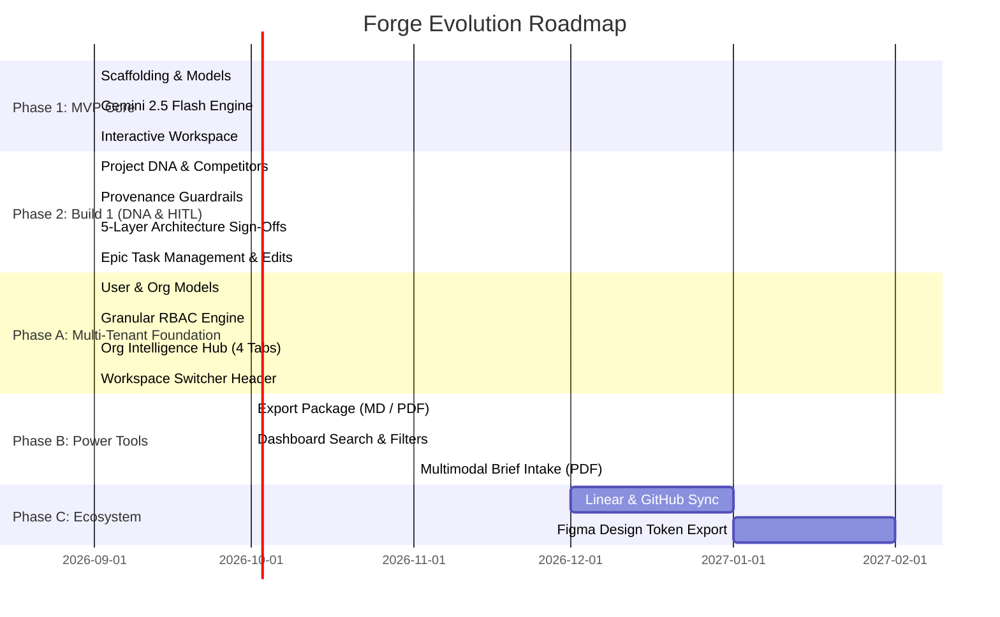

# Forge — System Architecture, Codebase Reference & Masterplan

> **Document Version:** 1.2.0 (Phase A Complete — Multi-Tenant Agency Foundation & Granular RBAC)  
> **Last Updated:** September 2026  
> **Repository:** [https://github.com/ShreyaParker/forge-mvp](https://github.com/ShreyaParker/forge-mvp)  
> **Target Audience:** Engineering Leads, Full-Stack Developers, Product Architects, and AI Engineers

---

## Table of Contents
1. [Executive Summary & Product Vision](#1-executive-summary--product-vision)
2. [End-to-End System Architecture](#2-end-to-end-system-architecture)
3. [Multi-Tenant Data Layer & Domain Models](#3-multi-tenant-data-layer--domain-models)
4. [Granular RBAC & Permissions Engine](#4-granular-rbac--permissions-engine)
5. [AI Intelligence Engine (Gemini 2.5 Flash)](#5-ai-intelligence-engine-gemini-25-flash)
6. [API Routes & Serverless Micro-Pipelines](#6-api-routes--serverless-micro-pipelines)
7. [Frontend Architecture & UI Systems](#7-frontend-architecture--ui-systems)
8. [Readiness Score & State Machine](#8-readiness-score--state-machine)
9. [Development, Seeding & Environments](#9-development-seeding--environments)
10. [Current Implementation Status](#10-current-implementation-status)
11. [Progress Masterplan & Roadmap](#11-progress-masterplan--roadmap)

---

## 1. Executive Summary & Product Vision

**Forge** is an AI-powered Project Intelligence, Agency Operating System & Dev-Handoff platform designed for modern product agencies, engineering consultancies, and bespoke dev shops.

### The Problem
Agencies lose hundreds of hours translating loose, unstructured client briefs (emails, meeting notes, PDFs, conversational wishlists) into actionable engineering artifacts. Furthermore, scaling agencies struggle with:
- Managing multi-tenant workspace separation between different teams and client engagements.
- Enforcing role-based permissions without rigid, hardcoded UI checks.
- Tracking organization-wide tech inventory, approved production stacks, and API subscription health.
- Assigning specific team members with appropriate skill proficiencies to project epics and tasks.
- Maintaining continuous context across brand guidelines, architecture choices, and dev backlogs.

### The Solution
Forge provides an integrated operating system that combines:
1. **Multi-Tenant Foundation:** Dual workspace modes (`Agency` collaborative team with role hierarchies vs `Individual` single-operator workspace).
2. **Granular RBAC:** Decoupled, permission-based access control matrix across 8 distinct agency roles.
3. **Organization Intelligence Hub:** Centralized management of Agency Profiles, Team Member Skills, Approved Tech Stack, and Live API Inventory.
4. **Project DNA & Context:** Market competitor benchmarking, clickable reference inspirations with domain extraction, and persistent prompt directives.
5. **Human-in-the-Loop Intelligence:** Real-time editable operational guardrails with provenance badges (`CLIENT`, `AI`, `HUMAN EDITED`), 5-layer architecture sign-offs, and Epic-level dev execution board.
6. **Mathematical Readiness Meter:** Live 11-point project completion metric (0–100%).

---

## 2. End-to-End System Architecture

### High-Level System Flowchart

```mermaid
flowchart TD
    subgraph Client["Client Tier (Next.js 15 App Router / React 19)"]
        WS["Workspace Switcher (components/WorkspaceSwitcher.tsx)"]
        A["Scoped Dashboard (app/page.tsx)"]
        B["Project Intake (app/projects/new/page.tsx)"]
        C["Project Workspace Shell (app/projects/[id]/page.tsx)"]
        D["Interactive Client Workspace (client-workspace.tsx)"]
        ORG["Organization Intelligence Hub (app/organization/page.tsx)"]
        
        subgraph WorkspaceTabs["Workspace Modular Component System"]
            T1["Brand & Guardrails (components/BrandGuardrailsTab.tsx)"]
            T2["Product & DNA (components/ProductPrdTab.tsx)"]
            T3["Tech Architecture Review (components/TechPlanTab.tsx)"]
            T4["Dev Execution Board (components/TasksTab.tsx)"]
            PB["Provenance Badges (components/ProvenanceBadge.tsx)"]
        end
        
        subgraph OrgTabs["Organization Hub Tabs"]
            O1["Overview & Profile"]
            O2["Team Roster & Skills"]
            O3["Tech Stack Inventory"]
            O4["API & Subscriptions Monitor"]
        end
        
        WS --> A
        C --> D
        D --> T1
        D --> T2
        D --> T3
        D --> T4
        T1 -.-> PB
        T2 -.-> PB
        ORG --> O1
        ORG --> O2
        ORG --> O3
        ORG --> O4
    end

    subgraph API["Backend API Layer (Next.js Serverless Route Handlers)"]
        AUTH["GET / POST /api/auth/session - Workspace Context"]
        ORGS["GET / POST /api/organizations - Workspaces"]
        ORG_ID["GET / PATCH /api/organizations/:id - Org Details"]
        MEMBERS["GET / POST /api/organizations/:id/members - Roster"]
        PROJS["GET / POST /api/projects - Scoped Projects"]
        PROJ_MUT["PATCH /api/projects/:id - Granular Mutations"]
        PROJ_DEL["DELETE /api/projects/:id - Scoped Delete"]
        AI_PIPES["POST /api/projects/:id/[analyze|prd|technical-plan|tasks]"]
    end

    subgraph Security["Security & Access Control"]
        SESS["Session Manager (lib/session.ts)"]
        PERM["Granular RBAC Engine (lib/permissions.ts)"]
        AUTH --> SESS
        PROJS --> PERM
        PROJ_MUT --> PERM
        PROJ_DEL --> PERM
    end

    subgraph Services["Services & Core Business Logic"]
        K["AI Service (services/ai.service.ts)"]
        M["Zod Schemas (schemas/aiAnalysis.ts)"]
        N["Readiness Calculator (lib/utils.ts)"]
        K --> M
    end

    subgraph External["External Cloud Services"]
        O["Google Gemini 2.5 Flash API (Google AI Studio)"]
        P["MongoDB Atlas Database"]
        Q["Mongoose Dynamic Connector (lib/dbConnect.ts)"] --> P
    end

    WS -- "Switch Active Org" --> AUTH
    A -- "Fetch Scoped Projects" --> PROJS
    B -- "Submit Brief" --> PROJS
    T1 -- "Mutate Guardrails" --> PROJ_MUT
    T2 -- "Update DNA & Directives" --> PROJ_MUT
    T3 -- "Sign-Off / ADR Override" --> PROJ_MUT
    T4 -- "Add / Edit / Delete Tasks" --> PROJ_MUT
    D -- "Trigger AI Pipelines" --> AI_PIPES
    ORG -- "Manage Org & Inventories" --> ORG_ID
    ORG -- "Manage Team & Skills" --> MEMBERS

    AUTH --> Q
    ORGS --> Q
    ORG_ID --> Q
    MEMBERS --> Q
    PROJS --> Q
    PROJ_MUT --> Q
    PROJ_DEL --> Q
    AI_PIPES --> K
    K --> O
    AI_PIPES --> Q
```



---

## 3. Multi-Tenant Data Layer & Domain Models

### 3.1 User (`models/User.ts`)
Represents an individual team member or client collaborator:
```typescript
export interface IUserSkill {
  name: string;
  level: 'Beginner' | 'Working' | 'Proficient' | 'Expert';
}

export interface IUser extends Document {
  name: string;
  email: string; // unique, indexed
  avatarUrl?: string;
  bio?: string;
  skills: IUserSkill[];
  gitIdentity?: {
    username: string;
    provider: 'github' | 'gitlab';
  };
  createdAt: Date;
  updatedAt: Date;
}
```

### 3.2 Organization (`models/Organization.ts`)
Represents a collaborative agency or individual studio workspace:
```typescript
export interface ITechInventoryItem {
  name: string;
  category: 'Frontend' | 'Backend' | 'Database' | 'AI' | 'Cloud' | 'DevOps' | 'Design' | 'Other';
  approvedForProduction: boolean;
  notes?: string;
}

export interface IApiInventoryItem {
  provider: string;
  service: string;
  status: 'Connected' | 'Available' | 'Not Connected' | 'Expiring';
  environment: 'Development' | 'Staging' | 'Production';
  notes?: string;
}

export interface IOrganization extends Document {
  name: string;
  slug: string; // unique, indexed
  workspaceType: 'Agency' | 'Individual';
  description?: string;
  website?: string;
  industry?: string;
  teamSize?: number;
  services: string[];
  specializations: string[];
  techInventory: ITechInventoryItem[];
  apiInventory: IApiInventoryItem[];
  createdAt: Date;
  updatedAt: Date;
}
```

### 3.3 Membership (`models/Membership.ts`)
Decouples users from organizations to support multi-workspace memberships:
```typescript
export type OrganizationRole =
  | 'Owner'
  | 'Admin'
  | 'Project Manager'
  | 'Strategist'
  | 'Designer'
  | 'Developer'
  | 'AI Engineer'
  | 'Viewer';

export type AvailabilityStatus = 'Available' | 'Partially Allocated' | 'Fully Booked';

export interface IMembership extends Document {
  userId: mongoose.Types.ObjectId; // ref: User, indexed
  organizationId: mongoose.Types.ObjectId; // ref: Organization, indexed
  role: OrganizationRole;
  customPermissions: string[];
  availability: AvailabilityStatus;
  joinedAt: Date;
}
```

### 3.4 Project (`models/Project.ts`)
Bound to an organization with team allocation and assigned tasks:
```typescript
export interface IProjectTeamMember {
  userId: mongoose.Types.ObjectId | string;
  role: string;
  assignedAt: Date;
}

export interface IProject extends Document {
  organizationId: mongoose.Types.ObjectId; // ref: Organization, indexed, required
  team: IProjectTeamMember[];
  basicInfo: {
    name: string;
    clientName: string;
    description: string;
    website?: string;
    targetPlatforms: string[];
  };
  dna?: IProjectDNA;
  brand?: {
    personality: string[];
    colors: { hex: string; role: string; source: ProvenanceSource }[];
    typography: string[];
    visualStyle: string;
    tone: string;
  };
  product?: {
    objective: string;
    targetUsers: string[];
    userJourneys: string[];
    coreFeatures: string[];
    successMetrics: string[];
  };
  guardrails?: {
    always: IGuardrailItem[];
    never: IGuardrailItem[];
  };
  aiAnalysis?: {
    summary: string;
    modules: string[];
    risks: string[];
    clarificationQuestions: string[];
    complexity: 'Low' | 'Medium' | 'High';
  };
  prd?: {
    sections: { title: string; content: string }[];
  };
  technicalPlan?: {
    frontend?: ITechPlanLayer;
    backend?: ITechPlanLayer;
    database?: ITechPlanLayer;
    auth?: ITechPlanLayer;
    infrastructure?: ITechPlanLayer;
    integrations?: ITechIntegration[];
  };
  tasks?: IProjectTask[]; // tasks carry optional assignedUserId
  readinessScore: number;
  status: 'Draft' | 'Analyzed' | 'Ready for Dev';
  createdAt: Date;
  updatedAt: Date;
}
```

---

## 4. Granular RBAC & Permissions Engine

### Permission Definitions (`lib/permissions.ts`)
Instead of hardcoding role names in UI logic, Forge evaluates granular permission strings:

| Permission String | Description |
| :--- | :--- |
| `projects:create` | Create new client projects in workspace |
| `projects:view` | View project list and workspace details |
| `projects:edit` | Edit project briefs, basic info, and metadata |
| `projects:delete` | Delete project records |
| `briefs:edit` | Update raw client brief descriptions |
| `ai:generate` | Trigger Gemini intelligence pipelines (PRD, Tasks, Tech) |
| `prd:view` / `prd:edit` | View or edit Product Requirements Document sections |
| `technical:view` / `technical:edit` | View stack or sign off architecture decisions |
| `tasks:create` / `tasks:assign` / `tasks:update` | Add, reassign, or toggle task status |
| `team:view` / `team:manage` | View member roster or invite/modify roles |
| `tech:view` / `tech:manage` | View or update agency tech inventory |
| `integrations:view` / `integrations:manage` | View or modify API subscription statuses |
| `git:view` / `git:manage` | View connected git identities and repositories |
| `settings:manage` | Update workspace profile and settings |

### Role-to-Permission Mapping Matrix

```text
┌─────────────────┬────────────────────────────────────────────────────────────────────────┐
│ Role            │ Granted Permissions                                                    │
├─────────────────┼────────────────────────────────────────────────────────────────────────┤
│ Owner           │ ALL PERMISSIONS (*)                                                    │
│ Admin           │ All except workspace deletion / billing transfer                       │
│ Project Manager │ projects:*, briefs:edit, prd:*, technical:view, tasks:*, team:view     │
│ Strategist      │ projects:view, briefs:edit, ai:generate, prd:*, team:view               │
│ Designer        │ projects:view, prd:view, tasks:update, team:view                       │
│ Developer       │ projects:view, technical:*, tasks:update, git:*, team:view             │
│ AI Engineer     │ projects:view, ai:generate, technical:*, tasks:update, git:*, team:view │
│ Viewer          │ projects:view, prd:view, technical:view, team:view                     │
└─────────────────┴────────────────────────────────────────────────────────────────────────┘
```

---

## 5. AI Intelligence Engine (Gemini 2.5 Flash)

Uses the official `@google/genai` library with structured JSON schema outputs (`responseMimeType: 'application/json'`).

### Multi-Stage Prompt Pipeline
1. **Analyze Brief:** Extracts brand personality, color palette with provenance tags, visual style, product objectives, user journeys, operational guardrails (`always`/`never`), and complexity.
2. **Generate PRD:** Ingests project basic info, product specs, guardrails, and **Project DNA persistent directives** to produce 6 markdown sections.
3. **Generate Technical Plan:** Produces recommendations across 5 architecture layers (Frontend, Backend, Database, Auth, Infrastructure) with `isApproved: false` by default, awaiting human engineering sign-off.
4. **Generate Tasks:** Deconstructs architecture and PRD into role-assigned tickets with day estimates.
5. **Resilient Fallback Layer:** Returns high-fidelity mock data structures matching the exact Zod schema if API keys are absent or quotas are exceeded.

---

## 6. API Routes & Serverless Micro-Pipelines

### Authentication & Multi-Tenant Session
- **`GET /api/auth/session`**: Returns active user, current organization, role, and granted permissions from cookie.
- **`POST /api/auth/session`**: Sets or switches the active workspace context in the session cookie (`{ organizationId, userId }`).

### Organization & Team Management
- **`GET /api/organizations`**: Returns all workspaces accessible by the current user.
- **`POST /api/organizations`**: Creates a new `Agency` or `Individual` organization.
- **`GET /api/organizations/:id`**: Returns organization details, tech stack inventory, and API status inventory.
- **`PATCH /api/organizations/:id`**: Updates agency profile, tech inventory approvals, and API subscriptions.
- **`GET /api/organizations/:id/members`**: Returns team roster with roles, skill tags, and availability.
- **`POST /api/organizations/:id/members`**: Adds/invites a user to the organization with assigned role.

### Multi-Tenant Project Operations
- **`GET /api/projects?orgId=:id`**: Returns projects strictly scoped to the active workspace.
- **`POST /api/projects`**: Creates an intake record bound to the active `organizationId`.
- **`GET /api/projects/:id`**: Fetches single project and normalizes legacy formats.
- **`PATCH /api/projects/:id`**: Handles granular workspace mutations:
  - `DNA_UPDATE`, `GUARDRAIL_ADD`, `GUARDRAIL_DELETE`, `TECH_DECISION_TOGGLE`, `TECH_INTEGRATION_UPDATE`, `TASK_CREATE`, `TASK_UPDATE`, `TASK_DELETE`, `TEAM_UPDATE`.
- **`DELETE /api/projects/:id`**: Scoped deletion protected by `projects:delete` permission check.
- **`POST /api/projects/:id/[analyze|prd|technical-plan|tasks]`**: Scoped AI generation endpoints.

---

## 7. Frontend Architecture & UI Systems

### Monochromatic Zinc/Slate Design Tokens
Built using **Tailwind CSS v4** with a sleek monochromatic dark theme:
- **Backgrounds:** `bg-zinc-950`, `bg-zinc-900/40`, `bg-zinc-900/60`.
- **Borders:** `border-zinc-800`, `border-zinc-700/60`.
- **Accents:** Emerald (`Ready for Dev`, `APPROVED`), Blue (`Analyzed`, `In Progress`), Amber (`PENDING SIGN-OFF`).

### Global Header & Workspace Switcher (`components/WorkspaceSwitcher.tsx`)
- Displayed in the sticky top navigation across all routes.
- Shows current active workspace name with an `AGENCY` (purple) or `INDIVIDUAL` (zinc) badge.
- Interactive dropdown allows instant switching between accessible organizations.
- Direct link to the **Organization Intelligence Hub**.

### Organization Intelligence Hub (`app/organization/page.tsx`)
1. **Tab 1: Overview & Profile:** Core agency description, services tags, specializations, website link, and team headcount.
2. **Tab 2: Team & Skills:** Team roster cards displaying avatar, bio, role badge, skill tags with proficiency pills (`Expert`, `Proficient`, `Working`), and availability status pills.
3. **Tab 3: Tech Inventory:** Category-grouped cards (Frontend, Backend, Database, AI, DevOps, Cloud, Design) with toggle switches for `Approved for Production`.
4. **Tab 4: API & Subscriptions:** Connectivity monitor for LLM providers (Gemini, OpenAI, Anthropic), cloud services (Vercel, AWS), and databases (Atlas, Redis) with real-time status pills (`Connected`, `Available`, `Not Connected`).

### Project Workspace Studio (`app/projects/[id]/client-workspace.tsx`)
1. **Tab 1: Brand & Guardrails:** Brand palette cards with provenance badges (`CLIENT`, `AI`, `HUMAN EDITED`), typography, style, and interactive "Always / Never" guardrail controls.
2. **Tab 2: Product & PRD:** Project DNA (competitors with add/remove, reference links with domain display, persistent directives) and 6-section PRD viewer.
3. **Tab 3: Tech Architecture:** 5 architecture decision cards with "Approve Decision" / "Revoke Sign-Off" toggles, sign-off progress bar, and inline ADR editing mode.
4. **Tab 4: Dev Execution Board:** Epic-grouped task columns, "+ Add Task" per Epic, global custom task modal, inline task editing, and status check cycling.

---

## 8. Readiness Score & State Machine

Evaluates 11 distinct attributes across the project record:

$$\text{Readiness Score} = \operatorname{round}\left(\frac{\sum \text{Filled Attributes}}{11} \times 100\right)$$

- Evaluates: Project Name, Client Name, Description, Brand Personality, Brand Colors, Product Objective, Always Guardrails, AI Analysis Summary, PRD Sections, Frontend Tech Recommendation, Tasks Backlog.

---

## 9. Development, Seeding & Environments

### Seed Data Suite (`scripts/seed.ts`)
Populates MongoDB Atlas with a complete multi-tenant dataset:
- **3 Users:**
  1. `Shreya Parkar` (Owner & AI/Full-Stack Lead)
  2. `Alex Rivera` (Product Lead & Strategist)
  3. `Marcus Chen` (Lead Dev & DevOps)
- **2 Organizations:**
  1. `Luminior Studio` (Agency workspace, 7 team members, 13 tech stack items, 6 connected API services)
  2. `Solo Lab` (Individual workspace for rapid prototyping)
- **4 Memberships:** Multi-workspace memberships linking users to organizations with roles and availability.
- **3 Projects linked to Luminior Studio:**
  1. `Nova Flagship Experience` (Ready for Dev, 100% readiness, full DNA, 5-layer tech decisions, 6 tasks assigned to team members).
  2. `Apex Fleet Telematics` (Analyzed, 100% readiness, IoT telematics DNA, time-series DB, tasks).
  3. `Zeta Flow Engine` (Draft, 73% readiness, HR workflow builder DNA).

---

## 10. Current Implementation Status

| Milestone Block | Status | Deliverables & Verification |
| :--- | :---: | :--- |
| **Next.js 15 & Turbopack Scaffolding** | ✅ Done | Zero build/lint errors, Next.js 16.3.6, React 19, strict TypeScript |
| **Multi-Tenant Models** | ✅ Done | `User`, `Organization`, `Membership`, and refactored `Project` |
| **Granular RBAC Engine** | ✅ Done | `lib/permissions.ts` with 14 granular permissions across 8 roles |
| **Workspace Session Context** | ✅ Done | `lib/session.ts` with cookie-backed active workspace switcher |
| **Organization Intelligence Hub** | ✅ Done | 4-tab studio (Overview, Team & Skills, Tech Stack, API Inventory) |
| **Project DNA & Context** | ✅ Done | `competitors`, `references` with domain extraction, `persistentInstructions` |
| **Structured Guardrails & Provenance** | ✅ Done | `always`/`never` with IDs and `CLIENT` \| `AI` \| `HUMAN EDITED` badges |
| **5-Layer Architecture Sign-Offs** | ✅ Done | Frontend, Backend, Database, Auth, Infra with approve/revoke toggles |
| **Inline ADR Overrides** | ✅ Done | Inline editing of architecture recommendations and rationales |
| **Dev Execution Board Power Tools** | ✅ Done | "+ Add Task" per Epic, custom task modal, inline title/role/estimate edits |
| **Multi-Tenant Scoped APIs** | ✅ Done | Projects strictly scoped to active `organizationId` |
| **Atlas Database Seeding** | ✅ Done | Automated seed script populating users, organizations, and projects |

---

## 11. Progress Masterplan & Roadmap


