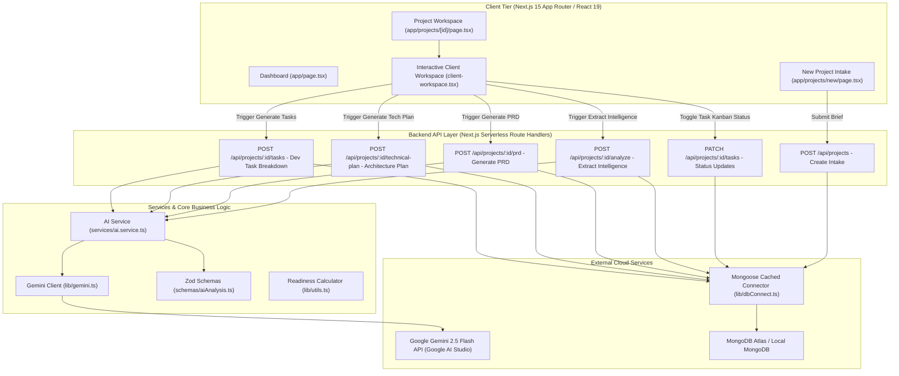
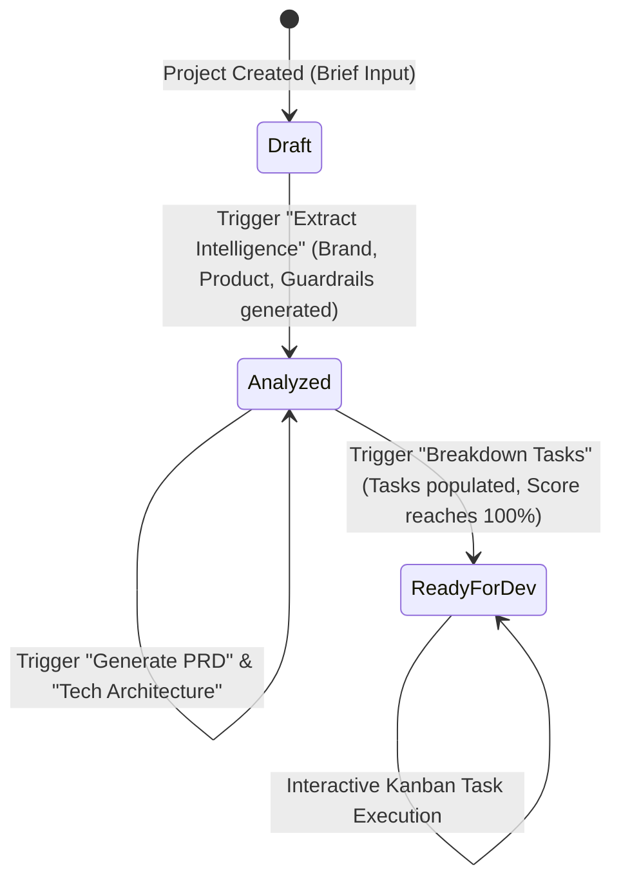
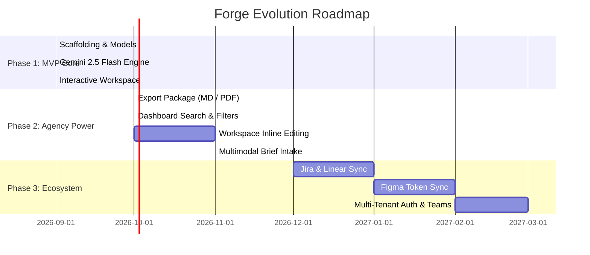

# Forge — System Architecture, Codebase Reference & Masterplan

> **Document Version:** 1.0.0  
> **Last Updated:** September 2026  
> **Repository:** [https://github.com/ShreyaParker/forge-mvp](https://github.com/ShreyaParker/forge-mvp)  
> **Target Audience:** Engineering Leads, Full-Stack Developers, Product Architects, and AI Engineers

---

## Table of Contents
1. [Executive Summary & Product Vision](#1-executive-summary--product-vision)
2. [End-to-End System Architecture](#2-end-to-end-system-architecture)
3. [Repository Directory Map](#3-repository-directory-map)
4. [Data Layer & Domain Models](#4-data-layer--domain-models)
5. [AI Intelligence Engine (Gemini 2.5 Flash)](#5-ai-intelligence-engine-gemini-25-flash)
6. [API Routes & Serverless Micro-Pipelines](#6-api-routes--serverless-micro-pipelines)
7. [Frontend Architecture & UI Systems](#7-frontend-architecture--ui-systems)
8. [Readiness Score & State Machine](#8-readiness-score--state-machine)
9. [Development, Seeding & Environments](#9-development-seeding--environments)
10. [Current Implementation Status](#10-current-implementation-status)
11. [Progress Masterplan & Roadmap](#11-progress-masterplan--roadmap)

---

## 1. Executive Summary & Product Vision

**Forge** is an AI-powered Project Intelligence & Dev-Handoff platform designed for modern product agencies, engineering consultancies, and internal tech teams.

### The Problem
Agencies lose hundreds of hours translating loose, unstructured client briefs (emails, meeting notes, PDFs, conversational wishlists) into actionable engineering artifacts. The transition from sales handoff to development kickoff frequently suffers from:
- Misaligned brand guidelines and design constraints.
- Unvetted technical architecture decisions.
- Incomplete Product Requirements Documents (PRDs).
- Disorganized task backlogs with arbitrary estimates.
- Premature engineering starts that cause costly mid-sprint rewrites.

### The Solution
Forge provides a vertical slice that ingests raw project briefs, executes multi-stage Gemini AI structuring routines, computes a live **Project Readiness Score (0–100%)**, and organizes intelligence across 4 interactive pillars:
1. **Brand & Guardrails:** Brand voice, color palette tokens, typography, visual style, and strict "Always / Never" operational guardrails.
2. **Product & PRD:** Target users, user journeys, core features, KPIs, and a full 6-section technical PRD.
3. **Tech Architecture:** Architectural rationale, frontend, backend, database recommendations, and essential integrations.
4. **Execution Board:** Epics, developer tasks, owner roles, priority flags, day estimates, and interactive Kanban statuses (`Todo` ➔ `In Progress` ➔ `Done`).

---

## 2. End-to-End System Architecture

### High-Level Architecture Diagram



### Data Flow Lifecycle
1. **Intake:** The user submits project title, client name, website URL, target platforms (Web, iOS, Android, macOS, Windows), and raw brief description.
2. **Persistence:** `Project` is saved in MongoDB in `Draft` status (Readiness ~27%).
3. **Sequential / Independent AI Augmentation:**
   - **Step 1: Analyze Brief:** Calls Gemini to infer brand personality, color palettes with hex values, typography, visual style, product objectives, user journeys, guardrails, risks, and complexity. Status becomes `Analyzed`.
   - **Step 2: Generate PRD:** Passes accumulated project context to Gemini to construct 6 markdown PRD sections.
   - **Step 3: Generate Technical Plan:** Evaluates the PRD and functional requirements to recommend optimal frontend, backend, database, and integrations.
   - **Step 4: Generate Tasks:** Deconstructs the architecture and PRD into distinct epics and granular engineering tickets with role assignments and estimates. Status transitions to `Ready for Dev` (100% Readiness).
4. **Execution & Feedback Loop:** Engineers interactively toggle task statuses on the execution board, instantly writing updates back to MongoDB.

---

## 3. Repository Directory Map

```text
forge-mvp/
├── .env.example                     # Environment template for developers
├── .env.local                       # Local secrets (MongoDB URI, Gemini API key) [Git-Ignored]
├── .gitignore                       # Rules preventing credentials & build artifacts leaking
├── AGENTS.md                        # Next.js 15 Turbopack agent rules & conventions
├── CLAUDE.md                        # Claude assistant context
├── doc/                             # Technical documentation suite
│   ├── ARCHITECTURE.md              # Complete codebase architecture & function reference
│   └── MASTERPLAN.md                # Roadmap, feature specs, and scaling guide
├── PRD.md                           # Original Product Requirements Document
├── README.md                        # Public-facing repository introduction & quickstart
├── package.json                     # Dependency manifests & npm scripts
├── tsconfig.json                    # Strict TypeScript configuration
├── next.config.ts                   # Next.js 15 build configuration
├── postcss.config.mjs               # PostCSS plugins
│
├── app/                             # Next.js App Router root
│   ├── globals.css                  # Tailwind CSS v4 design tokens & base resets
│   ├── layout.tsx                   # Root HTML shell, Inter font, global sticky navigation
│   ├── page.tsx                     # Agency Dashboard (Project listing & readiness badges)
│   ├── api/
│   │   └── projects/
│   │       ├── route.ts             # GET (list all) & POST (create intake)
│   │       └── [id]/
│   │           ├── route.ts         # GET (by id) & PATCH (update fields)
│   │           ├── analyze/
│   │           │   └── route.ts     # POST trigger: Extract Intelligence (Brand/Product/Guardrails)
│   │           ├── prd/
│   │           │   └── route.ts     # POST trigger: Generate PRD sections
│   │           ├── technical-plan/
│   │           │   └── route.ts     # POST trigger: Generate Tech Architecture
│   │           └── tasks/
│   │               └── route.ts     # POST trigger: Generate Backlog; PATCH: Toggle task status
│   └── projects/
│       ├── new/
│       │   └── page.tsx             # Interactive intake form for client brief
│       └── [id]/
│           ├── page.tsx             # Server Component: Fetch project, serialize, calculate readiness
│           └── client-workspace.tsx # Client Component: 4-tab interactive studio & AI triggers
│
├── lib/                             # Shared utility singletons
│   ├── dbConnect.ts                 # Global-cached Mongoose connection manager
│   ├── gemini.ts                    # GoogleGenAI SDK client initialization
│   └── utils.ts                     # Tailwind class merge (cn) & calculateReadiness logic
│
├── models/                          # Database models
│   └── Project.ts                   # Comprehensive Mongoose Schema & TypeScript IProject interface
│
├── schemas/                         # Zod validation schemas
│   └── aiAnalysis.ts                # Strict runtime schemas for Gemini JSON outputs
│
├── services/                        # Domain service layer
│   └── ai.service.ts                # Gemini API prompt orchestration & resilient fallback mocks
│
└── scripts/                         # Operational & automated testing utilities
    └── seed.ts                      # MongoDB seed script with rich test projects
```

---

## 4. Data Layer & Domain Models

### The Mongoose Project Schema (`models/Project.ts`)
The entire project lifecycle is encapsulated in a single, high-cohesion document schema designed to minimize relational joins and enable sub-second reads.

```typescript
export interface IProject extends Document {
  basicInfo: {
    name: string;
    clientName: string;
    description: string;
    website?: string;
    targetPlatforms: string[];
  };
  brand?: {
    personality: string[];
    colors: { hex: string; role: string; source: 'client' | 'ai' }[];
    typography: string[];
    visualStyle: string;
    tone: string;
  };
  product?: {
    objective: string;
    targetUsers: string[];
    userJourneys: string[];
    coreFeatures: string[];
    successMetrics: string[];
  };
  guardrails?: {
    always: string[];
    never: string[];
  };
  aiAnalysis?: {
    summary: string;
    modules: string[];
    risks: string[];
    clarificationQuestions: string[];
    complexity: 'Low' | 'Medium' | 'High';
  };
  prd?: {
    sections: { title: string; content: string }[];
  };
  technicalPlan?: {
    frontend: { recommendation: string; rationale: string };
    backend: { recommendation: string; rationale: string };
    database: { recommendation: string; rationale: string };
    integrations: { name: string; rationale: string }[];
  };
  tasks?: {
    id: string;
    epic: string;
    title: string;
    ownerRole: string;
    priority: string;
    estimateDays: number;
    status: 'Todo' | 'In Progress' | 'Done';
  }[];
  readinessScore: number;
  status: 'Draft' | 'Analyzed' | 'Ready for Dev';
  createdAt: Date;
  updatedAt: Date;
}
```

### Connection Caching Pattern (`lib/dbConnect.ts`)
In serverless environments (like Next.js route handlers and Vercel functions), traditional database connections get repeatedly re-created on every incoming request, exhausting MongoDB connection pools.

`lib/dbConnect.ts` uses the Node.js `global` object to cache active connections across hot reloads and lambda invocations:
```typescript
let cached = (global as any).mongoose;
if (!cached) {
  cached = (global as any).mongoose = { conn: null, promise: null };
}
```
- If `cached.conn` exists, it resolves immediately without latency.
- If a connection is in flight, `cached.promise` is returned so concurrent requests share the same handshake.
- If the connection fails, `cached.promise` is reset to allow graceful retries.

---

## 5. AI Intelligence Engine (Gemini 2.5 Flash)

### SDK Architecture
The project uses the latest official `@google/genai` library with structured JSON output enforcement (`responseMimeType: 'application/json'`).

Client instantiation in `lib/gemini.ts`:
```typescript
import { GoogleGenAI } from '@google/genai';

const apiKey = process.env.GEMINI_API_KEY;
export const ai = apiKey ? new GoogleGenAI({ apiKey }) : null;
```

### AI Service Functions (`services/ai.service.ts`)

Every AI method adheres to a two-tier resilience strategy:
1. **Primary Execution:** Formulates a system prompt with domain persona framing and calls Gemini `gemini-2.5-flash` with strict JSON constraints.
2. **Schema Validation:** Evaluates the response against Zod schemas in `schemas/aiAnalysis.ts`.
3. **Resilient Fallback Mode:** If `GEMINI_API_KEY` is not provided, if quotas are exhausted, or if network connectivity is severed, the service catches the error, logs a clean diagnostic note, and returns a high-fidelity mock data structure adhering to the exact schema. **The application never crashes.**

#### 1. `generateAiAnalysis(brief: string)`
- **Role Persona:** Principal Product Architect & Brand Strategist.
- **Input:** Raw brief text.
- **Output:**
  - Brand identity: personality tags, typography, visual style, hex colors with `source: 'ai'`.
  - Product specs: objectives, user personas, step-by-step user journeys, core features, KPIs.
  - Guardrails: "Always" and "Never" operational constraints.
  - Project complexity and architectural risk analysis.
- **Validated by:** `aiAnalysisSchema` (Zod).

#### 2. `generatePrd(projectContext: any)`
- **Role Persona:** Principal Product Manager.
- **Input:** Basic info + Product specs + Guardrails.
- **Output:** 6-section PRD:
  1. Executive Summary
  2. User Personas
  3. Functional Requirements
  4. Non-Functional Requirements
  5. Out of Scope
  6. Milestones & Delivery Schedule
- **Validated by:** `prdSchema` (Zod).

#### 3. `generateTechnicalPlan(projectContext: any)`
- **Role Persona:** Principal Software Architect.
- **Input:** Basic info + Product specs + PRD.
- **Output:** 
  - Recommended frontend framework + rationale.
  - Recommended backend / API strategy + rationale.
  - Recommended database + rationale.
  - Third-party SaaS / API integrations with justifications.
- **Validated by:** `technicalPlanSchema` (Zod).

#### 4. `generateTasks(prdContext: any)`
- **Role Persona:** Technical Lead & Scrum Master.
- **Input:** PRD sections + Technical Architecture.
- **Output:** Array of developer tasks, each with an ID (`TASK-X`), parent Epic (`Authentication`, `Core Engine`, `Dashboard`, etc.), title, assigned engineering role (`Frontend Eng`, `Backend Eng`, `DevOps`), priority (`High`, `Medium`, `Low`), day estimates, and default status `Todo`.
- **Validated by:** `tasksSchema` (Zod).

---

## 6. API Routes & Serverless Micro-Pipelines

All routes are located under `app/api/projects/` and leverage Next.js App Router Route Handlers:

| Endpoint | Method | Purpose | Input / Body | Output / Response |
| :--- | :---: | :--- | :--- | :--- |
| `/api/projects` | `GET` | Fetch all agency projects sorted by `createdAt: -1` | None | `Array<IProject>` |
| `/api/projects` | `POST` | Create a new project intake document | `{ name, clientName, website, description, targetPlatforms }` | `201 Created` + Created Project |
| `/api/projects/[id]` | `GET` | Fetch single project document by MongoDB ObjectId | None | `IProject` or `404 Not Found` |
| `/api/projects/[id]` | `PATCH` | Update general project metadata | Partial `<IProject>` | `IProject` |
| `/api/projects/[id]/analyze` | `POST` | Execute Gemini brief extraction | None | Updated `IProject` with Brand, Product, Guardrails, AI Analysis; Status = `Analyzed` |
| `/api/projects/[id]/prd` | `POST` | Generate 6-section Markdown PRD | None | Updated `IProject` with `prd.sections` |
| `/api/projects/[id]/technical-plan` | `POST` | Generate Technical Stack recommendations | None | Updated `IProject` with `technicalPlan` |
| `/api/projects/[id]/tasks` | `POST` | Deconstruct PRD into engineering task backlog | None | Updated `IProject` with `tasks`; Status = `Ready for Dev` |
| `/api/projects/[id]/tasks` | `PATCH` | Toggle status of a specific task ticket | `{ taskId: string, status: 'Todo' \| 'In Progress' \| 'Done' }` | Updated `IProject` |

---

## 7. Frontend Architecture & UI Systems

### Monochromatic Aesthetic & Design Tokens
Built using **Tailwind CSS v4** with a custom monochromatic Zinc/Slate color palette:
- **Backgrounds:** Ultra-dark slate/zinc tones (`#09090b` / `bg-zinc-950` to `bg-zinc-900/50`).
- **Borders:** Subtle hairline dividers (`border-zinc-800` to `border-zinc-700/60`).
- **Typography:** Crisp white headings (`text-white`) with high-contrast neutral body text (`text-zinc-400` / `text-zinc-300`).
- **Status Accents:**
  - `Ready for Dev`: High-visibility emerald badge (`bg-emerald-500/10 text-emerald-400 border-emerald-500/20`).
  - `Analyzed`: Electric blue badge (`bg-blue-500/10 text-blue-400 border-blue-500/20`).
  - `Draft`: Subdued neutral badge (`bg-zinc-500/10 text-zinc-400 border-zinc-500/20`).

### Page Breakdown

#### 1. Agency Dashboard (`app/page.tsx`)
- Server-rendered page fetching all projects directly via Mongoose.
- Displays project count, status badges, target platform pills, client name, and a visual **Readiness Progress Bar** for each project card.
- Features empty states and direct quick-navigation to create new projects.

#### 2. Intake Flow (`app/projects/new/page.tsx`)
- Intuitive client brief submission portal.
- Fields: Project Title, Client Organization, Website URL, Target Platforms (interactive toggle buttons for Web, iOS, Android, macOS, Windows), and Brief Textarea.
- Direct redirection to the newly instantiated project workspace upon submission.

#### 3. Project Workspace Shell (`app/projects/[id]/page.tsx`)
- Server component handling database retrieval and deep JSON serialization (`JSON.parse(JSON.stringify(doc))`).
- Prevents Next.js Server-to-Client component serialization warnings for Mongoose ObjectIds.
- Computes baseline readiness score on the server before hydration.

#### 4. Interactive Client Workspace (`app/projects/[id]/client-workspace.tsx`)
- Dynamic 4-tab interactive studio:
  - **Header Bar:** Client label, Project Name, Status badge, Quick AI Action trigger buttons (`Extract Intelligence`, `Generate PRD`, `Tech Architecture`, `Breakdown Tasks`), and circular SVG **Readiness Score Gauge**.
  - **Tab 1: Brand & Guardrails:**
    - Brand Personality tags.
    - Color Palette Swatches (Hex codes, color preview blocks, and "Client" vs "AI Generated" source badges).
    - Typography pairings, Visual Style, and Brand Tone cards.
    - Operational Guardrails: Dual-column grid distinguishing **Always** rules from **Never** rules.
    - AI Risk & Complexity diagnostics.
  - **Tab 2: Product & PRD:**
    - Primary Objective and Target User Persona pills.
    - User Journeys step breakdown.
    - Core Features with checkmark indicators.
    - Key Success Metrics / KPIs.
    - Full 6-section rendered PRD accordion/cards with markdown support.
  - **Tab 3: Tech Architecture:**
    - 3-column architecture cards for Frontend, Backend, and Database showing recommendations and detailed architectural rationales.
    - Recommended 3rd-party integrations list.
  - **Tab 4: Dev Execution Board:**
    - Tasks grouped by Epic (`Authentication`, `Dashboard`, `Core`, etc.).
    - Interactive status toggle buttons cycling between `Todo` ➔ `In Progress` ➔ `Done` with instant optimistic UI updates and background MongoDB synchronization.
    - Engineering role assignments (`Frontend Eng`, `Backend Eng`, `Full Stack`) and day estimate pills.

---

## 8. Readiness Score & State Machine

### The Readiness Calculation Engine (`lib/utils.ts`)
The Readiness Score is an agency-critical KPI that answers: **"Is this specification complete enough to hand over to engineers without ambiguity?"**

It evaluates 11 distinct attributes across the project document:
1. `basicInfo.name` (Project Name)
2. `basicInfo.clientName` (Client Name)
3. `basicInfo.description` (Brief Description)
4. `brand.personality` (Brand Personality Tags)
5. `brand.colors` (Color Palette)
6. `product.objective` (Core Product Objective)
7. `guardrails.always` (Design/Dev Guardrails)
8. `aiAnalysis.summary` (AI Executive Assessment)
9. `prd.sections` (Complete PRD Sections)
10. `technicalPlan.frontend` (Technical Stack Rationale)
11. `tasks.length > 0` (Dev Backlog Generated)

$$\text{Readiness Score} = \operatorname{round}\left(\frac{\sum \text{Filled Attributes}}{11} \times 100\right)$$

### Project State Machine



---

## 9. Development, Seeding & Environments

### Environment Configuration (`.env.local`)
```env
# Database (Local MongoDB or MongoDB Atlas)
MONGODB_URI=mongodb://localhost:27017/forge-mvp

# Gemini AI Engine (Google AI Studio)
GEMINI_API_KEY=your_gemini_api_key_here
GEMINI_MODEL=gemini-2.5-flash
```

### Seeding Test Data (`scripts/seed.ts`)
The seed script populates the database with realistic sample projects across varying states of completion:
- **Nova Flagship Experience** (`Ready for Dev`, 100% Readiness, complete PRD and interactive tasks).
- **Pulse Health Tracker** (`Draft`, 27% Readiness, ready for AI analysis demonstration).

Execute the seeder:
```bash
npx tsx scripts/seed.ts
```

### Verification & Automated Testing
The application includes browser automation via subagent recordings verifying all UI tabs, buttons, dynamic calculations, and Gemini pipeline triggers.

---

## 10. Current Implementation Status

| Component | Status | Details |
| :--- | :---: | :--- |
| **Scaffolding & Config** | ✅ Done | Next.js 15 App Router, TypeScript, Tailwind CSS v4, Lucide icons |
| **Database & Models** | ✅ Done | Mongoose `Project` schema with cached connection pooling |
| **Zod Validation** | ✅ Done | Runtime schema validation for all 4 AI output structures |
| **Gemini Integration** | ✅ Done | `@google/genai` with `gemini-2.5-flash` and structured JSON output |
| **Graceful Mock Fallback** | ✅ Done | Fallback data layer guaranteeing zero UI crashes if keys are absent |
| **Agency Dashboard** | ✅ Done | Live cards, readiness progress meters, status tags, empty states |
| **Project Intake Form** | ✅ Done | Full intake with platform selector and brief ingestion |
| **Interactive Workspace** | ✅ Done | 4 tabs (Brand, PRD, Architecture, Execution Board) |
| **Interactive Task Kanban**| ✅ Done | Optimistic UI toggles (`Todo` / `In Progress` / `Done`) synced to DB |
| **Readiness Calculator** | ✅ Done | 11-point mathematical completion score |
| **Version Control** | ✅ Done | Git initialized, credentials secured, pushed to GitHub `main` |

---

## 11. Progress Masterplan & Roadmap

The masterplan outlines the evolution from the current core engine into a full-scale enterprise agency intelligence system.



### Detailed Phase Specifications

#### Phase 2: Agency Power Tools (Immediate Priority)
1. **Specification Export Package:**
   - Single-click download of the complete project dossier.
   - Formatted as clean GitHub-flavored Markdown (`PROJECT-SPEC.md`) or printable styled PDF.
   - Includes executive brief, brand tokens, complete PRD, architecture decisions, and full task backlog table.
2. **Dashboard Search, Filtering & Sorting:**
   - Instant client-side or server-side full-text search across project titles, client names, and descriptions.
   - Filter pills: `All`, `Draft`, `Analyzed`, `Ready for Dev`.
   - Sort by Readiness Score (highest/lowest) and Last Modified.
3. **Workspace Inline Editing:**
   - Enable agency leads to manually refine AI outputs before developer handoff.
   - Add/remove guardrails, adjust color codes, edit persona descriptions, and insert custom tasks directly in the workspace.
4. **Multimodal Brief Intake (Gemini Vision & File API):**
   - Direct upload of client PDF briefs, slide decks (pitch decks), or recorded audio memos.
   - Gemini multimodal parsing to extract requirements automatically without manual copy-pasting.

#### Phase 3: Enterprise & Ecosystem Integrations
1. **Linear & GitHub Issues Sync:**
   - One-click export pushing generated tasks directly into Linear or GitHub Projects with labels, estimates, and assignees.
2. **Figma Design Token Export:**
   - Export generated color palettes and typography pairings directly into Figma Tokens JSON or Tailwind theme configs.
3. **Multi-User Collaboration & Authentication:**
   - NextAuth / Clerk integration supporting Role-Based Access Control (`Agency Admin`, `Project Lead`, `Developer`).
   - Project history versioning and audit logs.
