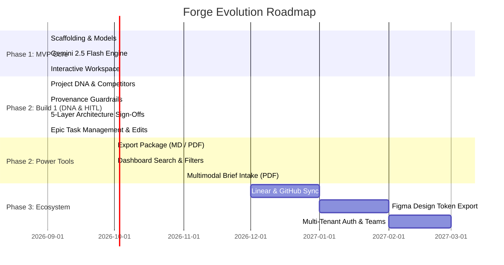

# Forge — System Architecture, Codebase Reference & Masterplan

> **Document Version:** 1.1.0 (Build 1 Complete — Human-in-the-Loop & Project DNA)  
> **Last Updated:** September 2026  
> **Repository:** [https://github.com/ShreyaParker/forge-mvp](https://github.com/ShreyaParker/forge-mvp)  
> **Target Audience:** Engineering Leads, Full-Stack Developers, Product Architects, and AI Engineers

---

## Table of Contents
1. [Executive Summary & Product Vision](#1-executive-summary--product-vision)
2. [End-to-End System Architecture](#2-end-to-end-system-architecture)
3. [Repository Directory Map](#3-repository-directory-map)
4. [Data Layer & Domain Models](#4-data-layer--domain-models)
5. [AI Intelligence Engine (Gemini 2.5 Flash)](#5-ai-intelligence-engine-gemini-25-flash)
6. [API Routes & Serverless Micro-Pipelines](#6-api-routes--serverless-micro-pipelines)
7. [Frontend Architecture & UI Systems](#7-frontend-architecture--ui-systems)
8. [Readiness Score & State Machine](#8-readiness-score--state-machine)
9. [Development, Seeding & Environments](#9-development-seeding--environments)
10. [Current Implementation Status](#10-current-implementation-status)
11. [Progress Masterplan & Roadmap](#11-progress-masterplan--roadmap)

---

## 1. Executive Summary & Product Vision

**Forge** is an AI-powered Project Intelligence & Dev-Handoff platform designed for modern product agencies, engineering consultancies, and internal tech teams.

### The Problem
Agencies lose hundreds of hours translating loose, unstructured client briefs (emails, meeting notes, PDFs, conversational wishlists) into actionable engineering artifacts. The transition from sales handoff to development kickoff frequently suffers from:
- Misaligned brand guidelines and design constraints.
- Unvetted technical architecture decisions made without engineering sign-off.
- Missing context regarding competitor benchmarks and agency-specific directives.
- Incomplete Product Requirements Documents (PRDs).
- Disorganized task backlogs with arbitrary estimates.
- Premature engineering starts that cause costly mid-sprint rewrites.

### The Solution
Forge provides a vertical slice that ingests raw project briefs, executes multi-stage Gemini AI structuring routines, captures explicit **Project DNA**, enables **Human-in-the-Loop** refinement across all intelligence blocks, computes a live **Project Readiness Score (0–100%)**, and organizes intelligence across 4 interactive pillars:
1. **Brand & Guardrails:** Brand voice, color palette tokens with provenance tags, typography, visual style, and structured "Always / Never" operational guardrails (`client` | `ai` | `human_edited`).
2. **Product & PRD:** Project DNA (competitors, reference links with domain extraction, persistent agency instructions), target users, user journeys, core features, KPIs, and a full 6-section technical PRD.
3. **Tech Architecture:** Interactive decision cards across 5 layers (Frontend, Backend, Database, Auth, Infrastructure) plus integrations, featuring human sign-off toggles and inline ADR editing.
4. **Execution Board:** Epics, developer tasks, owner roles, priority flags, day estimates, "+ Add Task" per Epic column, inline task edits, and interactive Kanban statuses (`Todo` ➔ `In Progress` ➔ `Done`).

---

## 2. End-to-End System Architecture

### High-Level Architecture Diagram

```mermaid
flowchart TD
    subgraph Client["Client Tier (Next.js 15 App Router / React 19)"]
        A["Dashboard (app/page.tsx)"]
        B["New Project Intake (app/projects/new/page.tsx)"]
        C["Project Workspace Shell (app/projects/[id]/page.tsx)"]
        D["Interactive Client Workspace (client-workspace.tsx)"]
        
        subgraph WorkspaceTabs["Workspace Modular Component System"]
            T1["Brand & Guardrails (components/BrandGuardrailsTab.tsx)"]
            T2["Product & DNA (components/ProductPrdTab.tsx)"]
            T3["Tech Architecture Review (components/TechPlanTab.tsx)"]
            T4["Dev Execution Board (components/TasksTab.tsx)"]
            PB["Provenance Badges (components/ProvenanceBadge.tsx)"]
        end
        
        C --> D
        D --> T1
        D --> T2
        D --> T3
        D --> T4
        T1 -.-> PB
        T2 -.-> PB
    end

    subgraph API["Backend API Layer (Next.js Serverless Route Handlers)"]
        E["POST /api/projects - Create Intake"]
        F["POST /api/projects/:id/analyze - Extract Intelligence"]
        G["POST /api/projects/:id/prd - Generate PRD (with DNA)"]
        H["POST /api/projects/:id/technical-plan - 5-Layer Stack Plan"]
        I["POST /api/projects/:id/tasks - Dev Task Breakdown"]
        J["PATCH /api/projects/:id - Granular Workspace Mutations"]
        J1["PATCH /api/projects/:id/tasks - Legacy Status Toggle"]
    end

    subgraph Services["Services & Core Business Logic"]
        K["AI Service (services/ai.service.ts)"]
        M["Zod Schemas (schemas/aiAnalysis.ts)"]
        N["Readiness Calculator (lib/utils.ts)"]
        K --> M
    end

    subgraph External["External Cloud Services"]
        O["Google Gemini 2.5 Flash API (Google AI Studio)"]
        P["MongoDB Atlas Database"]
        Q["Mongoose Dynamic Connector (lib/dbConnect.ts)"] --> P
    end

    D -- "Trigger Extract Intelligence" --> F
    D -- "Trigger Generate PRD" --> G
    D -- "Trigger Generate Tech Plan" --> H
    D -- "Trigger Generate Tasks" --> I
    
    T1 -- "Add / Delete Guardrails" --> J
    T2 -- "Update DNA & Directives" --> J
    T3 -- "Toggle Sign-Off / Edit Decision" --> J
    T4 -- "Add / Edit / Delete Tasks" --> J
    T4 -- "Toggle Kanban Status" --> J
    B -- "Submit Brief" --> E

    E --> Q
    F --> K
    G --> K
    H --> K
    I --> K
    J --> Q
    J1 --> Q
    K --> O
    F --> Q
    G --> Q
    H --> Q
    I --> Q
```



### Granular Workspace Mutation Protocol (`PATCH /api/projects/:id`)

Forge supports granular, type-safe mutations without requiring full document replacement:

```typescript
// Sub-payload signatures:
| { type: 'DNA_UPDATE', data: { competitors?, references?, persistentInstructions? } }
| { type: 'GUARDRAILS_UPDATE', data: { always?, never? } }
| { type: 'GUARDRAIL_ADD', data: { category: 'always' | 'never', text: string, source: 'client' | 'ai' | 'human_edited' } }
| { type: 'GUARDRAIL_DELETE', data: { category: 'always' | 'never', id: string } }
| { type: 'TECH_DECISION_TOGGLE', data: { layer: 'frontend' | 'backend' | 'database' | 'auth' | 'infrastructure', isApproved?: boolean, recommendation?: string, rationale?: string } }
| { type: 'TECH_INTEGRATION_UPDATE', data: { integrations: ITechIntegration[] } }
| { type: 'TASK_CREATE', data: { epic: string, title: string, ownerRole?: string, priority?: string, estimateDays?: number, status?: string } }
| { type: 'TASK_UPDATE', data: { taskId: string, title?: string, ownerRole?: string, priority?: string, estimateDays?: number, status?: string, epic?: string } }
| { type: 'TASK_DELETE', data: { taskId: string } }
```

Every mutation automatically triggers `calculateReadiness(project)` on the server before persisting.

---

## 3. Repository Directory Map

```text
forge-mvp/
├── .env.example                     # Environment template for developers
├── .env.local                       # Local secrets (MongoDB URI, Gemini API key) [Git-Ignored]
├── .gitignore                       # Rules preventing credentials & build artifacts leaking
├── AGENTS.md                        # Next.js 15 Turbopack agent rules & conventions
├── CLAUDE.md                        # Assistant context & agent instructions
├── doc/                             # Technical documentation suite
│   ├── ARCHITECTURE.md              # Complete codebase architecture, function reference & status
│   ├── BUILD_1_PLAN.md              # Build 1 implementation plan & functional requirements
│   └── MASTERPLAN.md                # Multi-phase roadmap, feature specs & delivery strategy
├── PRD.md                           # Original Product Requirements Document
├── README.md                        # Public-facing repository introduction & quickstart
├── package.json                     # Dependency manifests & npm scripts
├── tsconfig.json                    # Strict TypeScript configuration
├── next.config.ts                   # Next.js 15 build configuration
├── postcss.config.mjs               # PostCSS plugins
│
├── app/                             # Next.js App Router root
│   ├── globals.css                  # Tailwind CSS v4 design tokens & base resets
│   ├── layout.tsx                   # Root HTML shell, Inter font, global sticky navigation
│   ├── page.tsx                     # Agency Dashboard (Project listing & readiness badges)
│   ├── api/
│   │   └── projects/
│   │       ├── route.ts             # GET (list all normalized) & POST (create intake with default DNA)
│   │       └── [id]/
│   │           ├── route.ts         # GET (by id) & PATCH (granular mutations + score recalculation)
│   │           ├── analyze/
│   │           │   └── route.ts     # POST trigger: Extract Intelligence (Brand/Product/Guardrails)
│   │           ├── prd/
│   │           │   └── route.ts     # POST trigger: Generate PRD sections with DNA context
│   │           ├── technical-plan/
│   │           │   └── route.ts     # POST trigger: Generate 5-layer Tech Architecture Plan
│   │           └── tasks/
│   │               └── route.ts     # POST trigger: Generate Backlog; PATCH: Toggle task status
│   └── projects/
│       ├── new/
│       │   └── page.tsx             # Interactive intake form for client brief
│       └── [id]/
│           ├── page.tsx             # Server Component: Fetch project, normalize, compute readiness
│           ├── client-workspace.tsx # Orchestrator: State management, AI triggers & tab switching
│           └── components/          # Modular Workspace UI Components (BUILD 1)
│               ├── BrandGuardrailsTab.tsx # Tab 1: Colors, Style, Always/Never guardrails + Provenance
│               ├── ProductPrdTab.tsx      # Tab 2: Project DNA (Competitors, References, Directives) & PRD
│               ├── TechPlanTab.tsx        # Tab 3: 5 Decision Cards, Approve Toggles & Inline ADR Editing
│               ├── TasksTab.tsx           # Tab 4: Epic Columns, Add Task, Inline Edits & Sprint Metrics
│               └── ProvenanceBadge.tsx    # Reusable Provenance Badge (CLIENT, AI, HUMAN EDITED)
│
├── lib/                             # Shared utility singletons
│   ├── dbConnect.ts                 # Dynamic Mongoose connection manager with runtime logging
│   └── utils.ts                     # Tailwind class merge (cn) & 11-point calculateReadiness logic
│
├── models/                          # Database models
│   └── Project.ts                   # Enhanced Mongoose Schema, IProject interface & normalizeProject
│
├── schemas/                         # Zod validation schemas
│   └── aiAnalysis.ts                # Strict runtime schemas for Gemini JSON outputs & 5 tech layers
│
├── services/                        # Domain service layer
│   └── ai.service.ts                # Gemini API prompt orchestration with DNA injection & fallbacks
│
└── scripts/                         # Operational & automated testing utilities
    └── seed.ts                      # MongoDB seed script with rich test projects (Atlas/Local)
```

---

## 4. Data Layer & Domain Models

### The Enhanced Project Schema (`models/Project.ts`)

```typescript
export type ProvenanceSource = 'client' | 'ai' | 'human_edited';

export interface IProjectReference {
  name: string;
  url: string;
  notes?: string;
}

export interface IProjectDNA {
  competitors: string[];
  references: IProjectReference[];
  persistentInstructions: string;
}

export interface IGuardrailItem {
  id: string;
  text: string;
  source: ProvenanceSource;
}

export interface ITechPlanLayer {
  recommendation: string;
  rationale: string;
  isApproved: boolean;
}

export interface ITechIntegration {
  name: string;
  rationale: string;
  isApproved: boolean;
}

export interface IProjectTask {
  id: string;
  epic: string;
  title: string;
  ownerRole: string;
  priority: string;
  estimateDays: number;
  status: 'Todo' | 'In Progress' | 'Done';
}

export interface IProject extends Document {
  basicInfo: {
    name: string;
    clientName: string;
    description: string;
    website?: string;
    targetPlatforms: string[];
  };
  dna?: IProjectDNA;
  brand?: {
    personality: string[];
    colors: { hex: string; role: string; source: ProvenanceSource }[];
    typography: string[];
    visualStyle: string;
    tone: string;
  };
  product?: {
    objective: string;
    targetUsers: string[];
    userJourneys: string[];
    coreFeatures: string[];
    successMetrics: string[];
  };
  guardrails?: {
    always: IGuardrailItem[];
    never: IGuardrailItem[];
  };
  aiAnalysis?: {
    summary: string;
    modules: string[];
    risks: string[];
    clarificationQuestions: string[];
    complexity: 'Low' | 'Medium' | 'High';
  };
  prd?: {
    sections: { title: string; content: string }[];
  };
  technicalPlan?: {
    frontend?: ITechPlanLayer;
    backend?: ITechPlanLayer;
    database?: ITechPlanLayer;
    auth?: ITechPlanLayer;
    infrastructure?: ITechPlanLayer;
    integrations?: ITechIntegration[];
  };
  tasks?: IProjectTask[];
  readinessScore: number;
  status: 'Draft' | 'Analyzed' | 'Ready for Dev';
  createdAt: Date;
  updatedAt: Date;
}
```

### Backward Compatibility & Normalization Engine
To guarantee that older seed data or legacy documents with flat string arrays do not throw hydration or type errors, `models/Project.ts` exports:
- **`normalizeProject(raw: any)`**: Transforms any raw MongoDB document or `.lean()` output into the full typed schema structure with empty array fallbacks and boolean approval flags.
- **`normalizeGuardrailList(items, prefix)`**: Converts legacy string arrays `['Use WebP']` into structured objects `[{ id: 'always-1', text: 'Use WebP', source: 'ai' }]`.
- **Mongoose `pre('init')` Hook**: Intercepts raw MongoDB document instantiation before schema type casting to prevent casting errors.

### Dynamic Connection Manager (`lib/dbConnect.ts`)
```typescript
async function dbConnect() {
  if (cached.conn) return cached.conn;

  const uri = process.env.MONGODB_URI || 'mongodb://localhost:27017/forge-mvp';

  if (!cached.promise) {
    cached.promise = mongoose.connect(uri, opts).then((m) => {
      console.log('[dbConnect] Connected successfully to DB:', m.connection.name);
      return m;
    });
  }
  cached.conn = await cached.promise;
  return cached.conn;
}
```

---

## 5. AI Intelligence Engine (Gemini 2.5 Flash)

### SDK Architecture
Uses `@google/genai` with `gemini-2.5-flash` model and structured JSON outputs:
- **`generateAiAnalysis(brief)`**: Infers brand attributes, structured guardrails with `source: 'ai'`, product specs, and complexity analysis.
- **`generatePrd(projectContext)`**: Ingests project basic info, product specs, guardrails, and **Project DNA persistent instructions** to craft 6 production-grade PRD sections.
- **`generateTechnicalPlan(projectContext)`**: Generates recommendations across all 5 layers with `isApproved: false` by default, pending technical lead sign-off.
- **`generateTasks(prdContext)`**: Deconstructs architecture and PRD into role-assigned sprint tickets.
- **Fallback Mock Architecture**: If `GEMINI_API_KEY` is not present, all methods return rich, fully typed mock data.

---

## 6. API Routes & Serverless Micro-Pipelines

| Endpoint | Method | Purpose | Sub-Payload / Body | Response |
| :--- | :---: | :--- | :--- | :--- |
| `/api/projects` | `GET` | Fetch all projects | None | `Array<IProject>` (normalized) |
| `/api/projects` | `POST` | Create intake document | `{ name, clientName, description, ... }` | `201 Created` with default DNA & Guardrails |
| `/api/projects/[id]` | `GET` | Fetch single project | None | Normalized `IProject` |
| `/api/projects/[id]` | `PATCH` | Execute granular workspace mutation | `{ type: string, data: any }` | Updated `IProject` + updated `readinessScore` |
| `/api/projects/[id]/analyze` | `POST` | Run AI brief extraction | None | Brand, Product, Structured Guardrails, Analysis |
| `/api/projects/[id]/prd` | `POST` | Generate PRD (with DNA context) | None | 6 Markdown PRD sections |
| `/api/projects/[id]/technical-plan` | `POST` | Generate 5-Layer Stack Recommendation | None | Frontend, Backend, DB, Auth, Infra, Integrations |
| `/api/projects/[id]/tasks` | `POST` | Generate Dev Task Backlog | None | Epics & Tasks; Status = `Ready for Dev` |
| `/api/projects/[id]/tasks` | `PATCH` | Legacy task status update | `{ taskId, status }` | Updated `IProject` |

---

## 7. Frontend Architecture & UI Systems

### Monochromatic Zinc/Slate Design Language
- **Backgrounds:** Ultra-dark slate tones (`bg-zinc-950`, `bg-zinc-900/40`, `bg-zinc-900/60`).
- **Dividers:** Hairline borders (`border-zinc-800`, `border-zinc-700/60`).
- **Typography:** Crisp white headers (`text-white`) with high-contrast neutral secondary text (`text-zinc-400`, `text-zinc-500`).
- **Accent Signals:**
  - `Ready for Dev` / `APPROVED`: Emerald accents (`bg-emerald-500/10 text-emerald-400 border-emerald-500/30`).
  - `Analyzed` / `In Progress`: Electric blue accents (`bg-blue-500/10 text-blue-400 border-blue-500/30`).
  - `PENDING SIGN-OFF`: Amber warning accents (`bg-amber-500/10 text-amber-400 border-amber-500/30`).

### Workspace Tab Components (`app/projects/[id]/components/`)

#### 1. Brand & Guardrails Tab (`BrandGuardrailsTab.tsx`)
- Brand personality tags, visual style, brand tone, and typography tokens.
- Color palette cards displaying hex values, preview blocks, and `ProvenanceBadge` tags.
- **Operational Guardrails Grid:**
  - "Always Do" and "Never Do" rule cards with provenance badges.
  - Interactive inputs with provenance selector (`HUMAN EDITED`, `CLIENT`, `AI`).
  - Real-time trash/delete triggers with instant UI update and database persistence.

#### 2. Product & PRD Tab (`ProductPrdTab.tsx`)
- **Project DNA & Context Section:**
  - Competitor landscape: Pill tags with instant remove (`×`) and inline addition input.
  - Architecture & style reference links: Domain extraction (e.g. `linear.app`), clickable external links, benchmark notes, and deletion triggers.
  - Agency Directives / System Instructions: Auto-saving persistent instructions textarea with real-time "Saved" feedback.
- Product specs (Objective, Target Users, User Journeys, Core Features, KPIs).
- Full 6-section rendered PRD with "Copy Markdown" button.

#### 3. Tech Architecture Review Tab (`TechPlanTab.tsx`)
- **5 Decision Cards:** Frontend, Backend, Database, Authentication & Security, Cloud Infrastructure & CDN.
- **Decision Status:** Approved (green badge) vs Pending Sign-Off (amber badge).
- **"Approve Decision" / "Revoke Sign-Off" Button:** Real-time sign-off progress bar (`X of 5 Layers Approved`).
- **Inline "Edit Decision" Mode:** Form allowing tech leads to overwrite recommendation and rationale ADRs.
- **Third-Party Integrations:** Configurable SaaS integrations with approval toggles and additions.

#### 4. Dev Execution Board Tab (`TasksTab.tsx`)
- Sprint metrics bar: Total backlog count, completed tasks, in-progress tasks, and total estimated engineer days.
- Tasks grouped by Epic (`Storefront`, `Checkout`, `Telemetry`, etc.).
- "+ Add Task" button on each Epic header and global "Add Custom Task" modal.
- Inline editing mode for Title, Owner Role, Priority (`High`, `Medium`, `Low`), and Day Estimates.
- Interactive status checkboxes cycling `Todo` ➔ `In Progress` ➔ `Done` with optimistic updates.
- Task deletion with real-time backlog recalculation.

#### 5. Provenance Badge (`ProvenanceBadge.tsx`)
- Standardized provenance indicator across the workspace:
  - `CLIENT` (Slate)
  - `AI RECOMMENDATION` (Blue)
  - `HUMAN EDITED` (Emerald)

---

## 8. Readiness Score & State Machine

### 11-Point Mathematical Readiness Engine (`lib/utils.ts`)

Evaluates the completeness of the project specification before engineering handoff:

```typescript
export function calculateReadiness(project: any): number {
  if (!project) return 0;
  const attributes = [
    Boolean(project.basicInfo?.name?.trim?.()),
    Boolean(project.basicInfo?.clientName?.trim?.()),
    Boolean(project.basicInfo?.description?.trim?.()),
    Boolean(project.brand?.personality && project.brand.personality.length > 0),
    Boolean(project.brand?.colors && project.brand.colors.length > 0),
    Boolean(project.product?.objective?.trim?.()),
    Boolean(project.guardrails?.always && project.guardrails.always.length > 0),
    Boolean(project.aiAnalysis?.summary?.trim?.()),
    Boolean(project.prd?.sections && project.prd.sections.length > 0),
    Boolean(project.technicalPlan?.frontend?.recommendation?.trim?.()),
    Boolean(project.tasks && project.tasks.length > 0),
  ];

  const total = attributes.length;
  const filled = attributes.filter(Boolean).length;
  return Math.round((filled / total) * 100);
}
```

---

## 9. Development, Seeding & Environments

### Seed Data Suite (`scripts/seed.ts`)
Populates MongoDB (Atlas or local) with 3 production-grade demo projects showcasing all Build 1 features:
1. **Nova Flagship Experience** (`Ready for Dev`, 100% Readiness):
   - Luxury fashion e-commerce flagship overhaul.
   - Competitors: `SSENSE`, `Farfetch`, `Net-a-Porter`.
   - References: `Aime Leon Dore`, `Acne Studios`.
   - Structured guardrails with client, AI, and human provenance.
   - 5-layer tech plan with partial human approvals and Shopify/Klaviyo integrations.
   - 5 initial tasks under `Storefront`, `Checkout`, and `Infrastructure`.
2. **Apex Fleet Telematics** (`Analyzed`, 100% Readiness):
   - High-frequency IoT telematics dashboard for 500+ commercial delivery vehicles.
   - Competitors: `Samsara`, `Geotab`, `Motive`.
   - References: `Samsara Fleet UI`, `FlightAware Tracker`.
   - Time-series MongoDB architecture, WebSockets, and Mapbox GL vector clustering.
3. **Zeta Flow Engine** (`Draft`, 73% Readiness):
   - Internal HR automation workflow engine with node-based canvas architecture.
   - Competitors: `Zapier`, `Workato`, `Make.com`.

---

## 10. Current Implementation Status

| Milestone Block | Status | Deliverables & Verification |
| :--- | :---: | :--- |
| **Next.js 15 & Turbopack Scaffolding** | ✅ Done | Zero build/lint errors, Next.js 16.3.6, React 19, TypeScript strict mode |
| **Project DNA Schema** | ✅ Done | `competitors`, `references`, `persistentInstructions` in Mongoose and UI |
| **Structured Guardrails & Provenance** | ✅ Done | `always`/`never` with IDs and `client` \| `ai` \| `human_edited` badges |
| **5-Layer Architecture & Sign-Offs** | ✅ Done | Frontend, Backend, Database, Auth, Infra with "Approve Decision" toggles |
| **Inline ADR Overrides** | ✅ Done | Inline editing of architecture recommendations and rationales |
| **Dev Execution Board Power Tools** | ✅ Done | "+ Add Task" per Epic, custom task modal, inline title/role/estimate editing |
| **Granular PATCH API Route** | ✅ Done | `DNA_UPDATE`, `GUARDRAIL_ADD/DELETE`, `TECH_DECISION_TOGGLE`, `TASK_CREATE/UPDATE/DELETE` |
| **Atlas Database Seeding** | ✅ Done | Automated seed script populating 3 rich reference projects |
| **Browser End-to-End Verification** | ✅ Done | Verified guardrail persistence, tech sign-off toggles, and task additions |

---

## 11. Progress Masterplan & Roadmap


